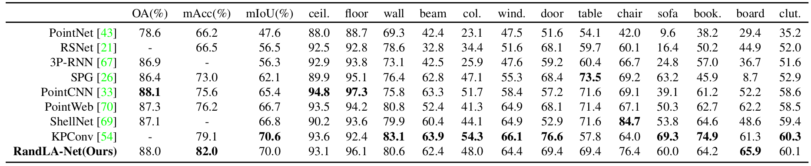
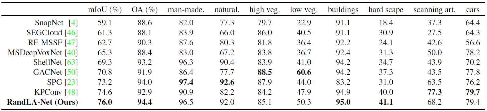
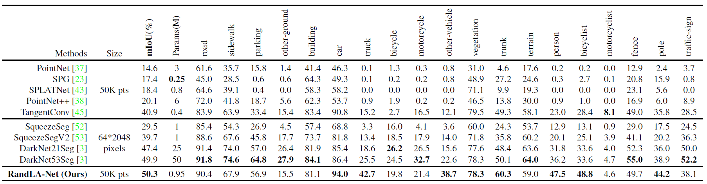
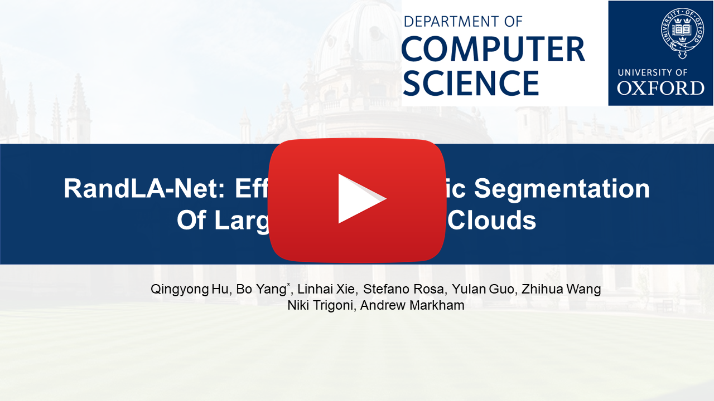

[](https://paperswithcode.com/sota/semantic-segmentation-on-semantic3d?p=191111236)
[](https://paperswithcode.com/sota/3d-semantic-segmentation-on-semantickitti?p=191111236)
[](https://creativecommons.org/licenses/by-nc-sa/4.0/legalcode)

# RandLA-Net: Efficient Semantic Segmentation of Large-Scale Point Clouds (CVPR 2020)

This is the official implementation of **RandLA-Net** (CVPR2020, Oral presentation), a simple and efficient neural architecture for semantic segmentation of large-scale 3D point clouds. For technical details, please refer to:
 
**RandLA-Net: Efficient Semantic Segmentation of Large-Scale Point Clouds** <br />
[Qingyong Hu](https://www.cs.ox.ac.uk/people/qingyong.hu/), [Bo Yang*](https://yang7879.github.io/), [Linhai Xie](https://www.cs.ox.ac.uk/people/linhai.xie/), [Stefano Rosa](https://www.cs.ox.ac.uk/people/stefano.rosa/), [Yulan Guo](http://yulanguo.me/), [Zhihua Wang](https://www.cs.ox.ac.uk/people/zhihua.wang/), [Niki Trigoni](https://www.cs.ox.ac.uk/people/niki.trigoni/), [Andrew Markham](https://www.cs.ox.ac.uk/people/andrew.markham/). <br />
**[[Paper](https://arxiv.org/abs/1911.11236)] [[Video](https://youtu.be/Ar3eY_lwzMk)] [[Blog](https://zhuanlan.zhihu.com/p/105433460)]** <br />
 
 
<p align="center">  </p>


	
### (1) Setup
This code has been tested with Python 3.5, Tensorflow 1.11, CUDA 9.0 and cuDNN 7.4.1 on Ubuntu 16.04.
 
- Clone the repository 
```
git clone --depth=1 https://github.com/QingyongHu/RandLA-Net && cd RandLA-Net
```
- Setup python environment
```
conda create -n randlanet python=3.5
source activate randlanet
pip install -r helper_requirements.txt
sh compile_op.sh
```

**Update 03/21/2020, pre-trained models and results are available now.** 
You can download the pre-trained models and results [here](https://drive.google.com/open?id=1iU8yviO3TP87-IexBXsu13g6NklwEkXB).
Note that, please specify the model path in the main function (e.g., `main_S3DIS.py`) if you want to use the pre-trained model and have a quick try of our RandLA-Net.

### (2) S3DIS
S3DIS dataset can be found 
<a href="https://docs.google.com/forms/d/e/1FAIpQLScDimvNMCGhy_rmBA2gHfDu3naktRm6A8BPwAWWDv-Uhm6Shw/viewform?c=0&w=1">here</a>. 
Download the files named "Stanford3dDataset_v1.2_Aligned_Version.zip". Uncompress the folder and move it to 
`/data/S3DIS`.

- Preparing the dataset:
```
python utils/data_prepare_s3dis.py
```
- Start 6-fold cross validation:
```
sh jobs_6_fold_cv_s3dis.sh
```
- Move all the generated results (*.ply) in `/test` folder to `/data/S3DIS/results`, calculate the final mean IoU results:
```
python utils/6_fold_cv.py
```

Quantitative results of different approaches on S3DIS dataset (6-fold cross-validation):



Qualitative results of our RandLA-Net:

|    |  |
| ------------------------------ | ---------------------------- |


### (3) Semantic3D
7zip is required to uncompress the raw data in this dataset, to install p7zip:
```
sudo apt-get install p7zip-full
```
- Download and extract the dataset. First, please specify the path of the dataset by changing the `BASE_DIR` in "download_semantic3d.sh"    
```
sh utils/download_semantic3d.sh
```
- Preparing the dataset:
```
python utils/data_prepare_semantic3d.py
```
- Start training:
```
python main_Semantic3D.py --mode train --gpu 0
```
- Evaluation:
```
python main_Semantic3D.py --mode test --gpu 0
```
Quantitative results of different approaches on Semantic3D (reduced-8):



Qualitative results of our RandLA-Net:

|     |    |
| -------------------------------- | ------------------------------- |


**Note:** 
- Preferably with more than 64G RAM to process this dataset due to the large volume of point cloud


### (4) SemanticKITTI

SemanticKITTI dataset can be found <a href="http://semantic-kitti.org/dataset.html#download">here</a>. Download the files
 related to semantic segmentation and extract everything into the same folder. Uncompress the folder and move it to 
`/data/semantic_kitti/dataset`.
 
- Preparing the dataset:
```
python utils/data_prepare_semantickitti.py
```

- Start training:
```
python main_SemanticKITTI.py --mode train --gpu 0
```

- Evaluation:
```
sh jobs_test_semantickitti.sh
```

Quantitative results of different approaches on SemanticKITTI dataset:



Qualitative results of our RandLA-Net:

    


### (5) Demo

<p align="center"> <a href="https://youtu.be/Ar3eY_lwzMk"></a> </p>


### Citation
If you find our work useful in your research, please consider citing:

	@article{hu2019randla,
	  title={RandLA-Net: Efficient Semantic Segmentation of Large-Scale Point Clouds},
	  author={Hu, Qingyong and Yang, Bo and Xie, Linhai and Rosa, Stefano and Guo, Yulan and Wang, Zhihua and Trigoni, Niki and Markham, Andrew},
	  journal={Proceedings of the IEEE Conference on Computer Vision and Pattern Recognition},
	  year={2020}
	}


### Acknowledgment
-  Part of our code refers to <a href="https://github.com/jlblancoc/nanoflann">nanoflann</a> library and the the recent work <a href="https://github.com/HuguesTHOMAS/KPConv">KPConv</a>.
-  We use <a href="https://www.blender.org/">blender</a> to make the video demo.


### License
Licensed under the CC BY-NC-SA 4.0 license, see [LICENSE](./LICENSE).


### Updates
* 21/03/2020: Updating all experimental results
* 21/03/2020: Adding pretrained models and results
* 02/03/2020: Code available!
* 15/11/2019: Initial release！
